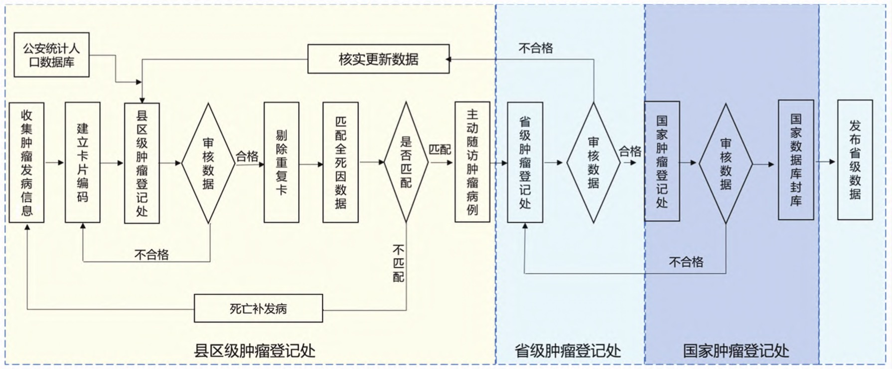

```{r,echo=FALSE,fig.cap="肿瘤登记数据上报流程图"}

```


为规范肿瘤登记工作的开展，提升肿瘤登记数据质量，进一步推动肿瘤登记工作的进程，以国际上肿瘤登记现状和趋势为依据，结合河南省肿瘤登记工作经验及现状，并参考专家意见，制定了以人群为基础的肿瘤登记工作规范。结果显示，建立以人群为基础的肿瘤登记处是开展肿瘤登记工作的基础，省卫生健康行政部门和中医药管理部门负责建立健全本辖区肿瘤登记制度，组织、协调、监督和管理本辖区肿瘤登记工作，指定省级癌症中心为省级肿瘤登记中心，承担全省肿瘤登记工作。市、县级卫生行政部门和中医药行政部门组织、协调、监督和管理本辖区的肿瘤登记工作。选择登记覆盖区域内的户籍人群作为肿瘤登记的目标人群，采用被动和主动收集相结合的方法，收集目标人群中所有恶性肿瘤、原位癌等的发病、死亡和生存信息，以及相关人口学统计资料信息，并开展随访工作。从可比性、完整性、有效性和时效性4个方面对肿瘤登记数据的质量进行评估。提示，健全的肿瘤登记工作规范是肿瘤登记工作质量的坚实保障。在肿瘤登记处迅速增加的背景下，依据肿瘤登记工作规范开展肿瘤登记工作，对于提高肿瘤登记数据的质量至关重要，从而为肿瘤防控提供真实可靠的基础数据。 

【关键词】	肿瘤登记; 肿瘤监测; 工作规范; 肿瘤防控;


[点击阅读全文](https://chenq.site/papers/guideline.pdf)
