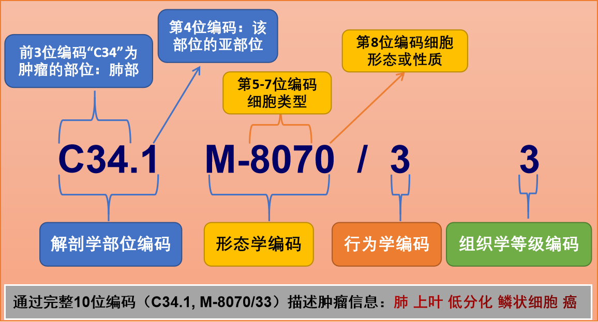

ICD-O3 （International Classification of Disease for Oncology third edition，ICD-O3）是国际疾病分类肿瘤学专辑第三版。它是一个既有解剖学部位、又有形态学编码系统的双重分类体系，目前被广泛应用于肿瘤随访登记的数据收集系统和医疗实践中。

它于1976年被WHO正式发布并应用（ICD-O1），而分别于1990年（ICD-O2）和2000年（ICD-O3）进行了两次较大的版本更新，而ICDO3也于2019年5月份更新到了第二版[（ICD-O3.2）](http://www.iacr.com.fr/index.php?Itemid=577)，并被推荐应用到肿瘤登记工作中。而ICD-O工作组也正着手ICD-O4的撰写工作，预计于2023年8月份完成，届时ICD-O编码的形态学编码也会增加至5位。

一套完整的ICDO3编码由四部分组成，共10个数字或字符，分别为：解剖学部位编码（4位）；形态学编码（4位）；动态编码（1位）；等级或分化程度编码（1位）。每一部分编码代表不同的含义：

参考下图图解。

### 解剖学部位编码

解剖学部位编码共4位，以大写字母"C"开头，用以描述肿瘤的原发部位，如（C15.1），字母C后面两位数字描述的肿瘤原发部位的主要部位信息，小数点后面一位数字描述肿瘤的亚部位。比如：C15.1描述肿瘤发生于食管（C15）的食管胸部（C15.1）。编码范围为：C00-C80。

### 形态学编码

形态学编码共4位，以大写字母M开头，用以描述肿瘤的细胞学类型和生物学活性，即肿瘤本身的特性。M后面的前3位数字代表组织或细胞类型，例如：809-811代表基底细胞、974代表肥大细胞、817代表干细胞；M后的第4位数字代表形态或性质。

### 动态编码

动态编码共1位数字，描述肿瘤的良、恶性，用"/0"、"/1"、"/2"、"/3"、"/6"、"/9"来表示，分别代表不同良恶性信息，具体如下：

-   /0: 表示良性肿瘤；
-   /1: 表示良性或恶性未肯定（交界恶性）；
-   /2: 表示原位癌；
-   /3: 表示原发部位的恶性肿瘤；
-   /6: 表示继发部位的恶性肿瘤；
-   /9: 表示恶性肿瘤无法区分原发与否。

### 组织学等级或分化程度编码

等级或分化程度编码共1位数字，用以描述肿瘤的等级或分化程度，用1、2、3、4、5、6、7、8、9表示，具体意义如下：

| 编码       | 意义                                                                   |
|---------|---------------------------------------------------------------------|
| 1           | I级：高分化或已分化NOS                                                 |
| 2    | II级：中分化或已中等分化                                               |
| 3    | III级：低分化                                                          |
| 4    | IV级：未分化或间变                                                     |
| 5    | T细胞                                                                  |
| 6    | B细胞/前B细胞/B前体细胞(仅用淋巴瘤白血病)                              |
| 7    | 无标记淋巴细胞或非T/非B细胞(M9590-M9989)                               |
| 8    | NK细胞                                                                 |
| 9    | 等级或分化程度未确定，未指出或不适用的细胞类型未确定，未指出或不适用的 |

### 举例

-   C15.9,M8070/32 表示中分化食管鳞状细胞癌
-   C16.0,M8140/33 表示低分化胃贲门腺癌
-   C16.3,M8490/33 表示胃窦后壁溃疡型印戒细胞癌

### 编码的意义

-   标准化：ICDO编码的推行和应用有助于疾病名称的标准化、格式化，也是医院信息管理等临床信息系统应用的基础；
-   共享性：编码使得疾病信息得到最大范围的共享；
-   利于管理：编码是医院医疗和管理的依据。