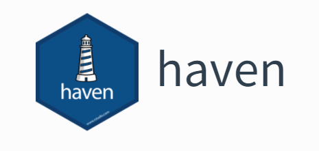

我们每个人都有自己比较熟悉的统计软件，日常工作中也都会用自己熟悉的软件进行数据处理、统计分析、作图或者其它工作；但是，如果我们想要进行的分析在当前的软件中比较难实现或者没有成熟的程序可用时，那么我们就可能需要把中间数据导出来，然后再利用另外一个软件来进一步处理。

今天我们就来介绍一个R包，**haven包**，由大神Hadley Wickham编写，它是tidyverse包的一部分。它使R能够*读取*和*保存*其他统计软件的数据格式，目前*haven包*支持的统计软件包括：SAS软件、SPSS软件、Stata软件.具体如下：

- *SAS*：通过read_sas()函数读取".sas7bdat"和".sas7bcat"数据，并通过write_sas()函数保存相应的数据。
- *SPSS*：通过read_sav()函数读取".sav"数据，通过read_por()函数读取老版本的".por"数据；并通过write_sav()函数保存成“.sav”数据。
- *Stata*：通过read_dta()函数读取“.dta”数据；通过write_dta()函数保存成Stata的".dta"数据。

通过haven包读取的其它软件的数据的输出结果为：

- 其它软件格式数据通过haven包读取到R环境之后，被转换为tibble格式，从而能够更好的在R里显示超长或超宽的数据框。
- 把原来数据里的值标签转换为新的labelled()类
- 日期和时间被转换为R日期时间类型，字符型向量不被转换为因子类型。

## 安装

你可以安装整个tidyverse包，里面包含haven包
```r
install.packages("tidyverse")
```
当然你也可以单独haven包
```r
install.packages("haven")
```
## 使用方法

```r
library(haven)

# SAS
read_sas("mtcars.sas7bdat")
write_sas(mtcars, "mtcars.sas7bdat")

# SPSS
read_sav("mtcars.sav")
write_sav(mtcars, "mtcars.sav")

# Stata
read_dta("mtcars.dta")
write_dta(mtcars, "mtcars.dta")
```

## 其它相关R包

- foreign包 读取SAS XPORT,SPSS,和Stata数据
- readstat13 读取和写入stata格式数据
- sas7bdat 读取SAS软件SAS7BDAT数据

