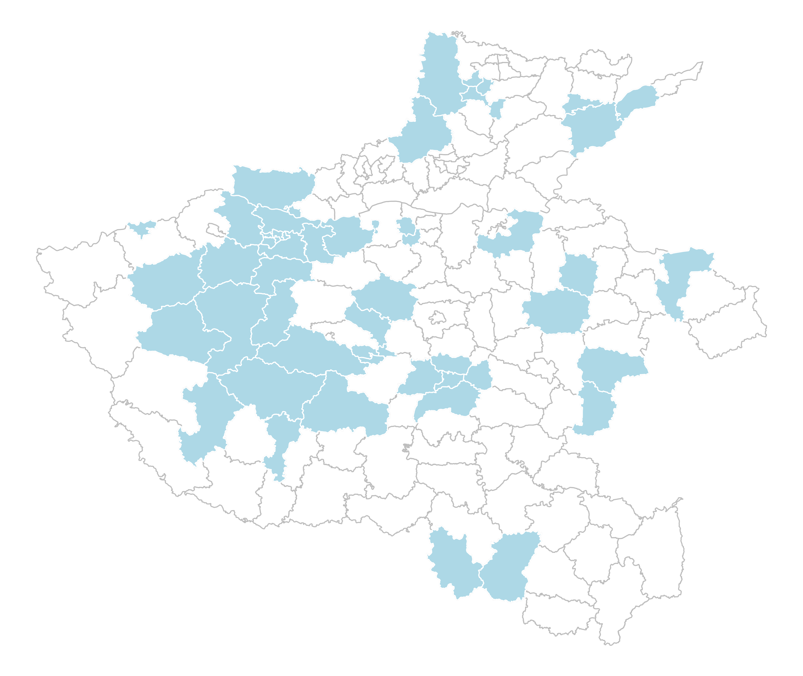
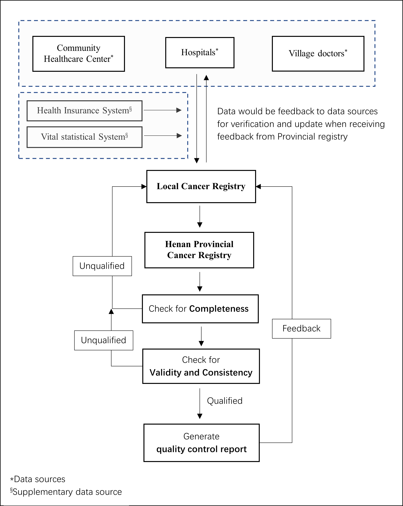
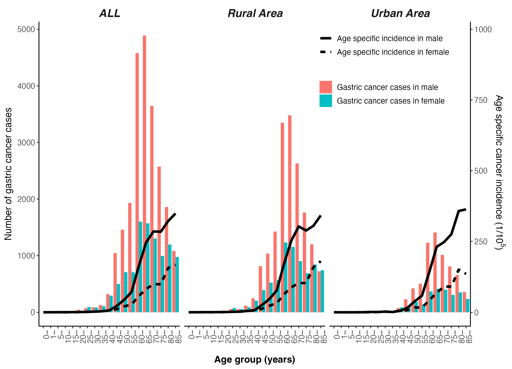

## Background 
Endoscopic screening program was carried out in Henan Province, China to reduce the large gastric cancer burden, and its effect evidence is insufficient. Knowledge on current status and time-trend of gastric cancer is need for policy makers to optimize the strategy of gastric cancer control.

## Methods
Gastric cancer data were pooled from registries in the Henan Cancer Registration System which may reflect the whole province cancer incidence and mortality. The pooled registration data, stratified by area (urban/rural), gender, and age groups, was combined with the provincial population data to estimate the incidence and mortality of gastric cancer in Henan Province. The Segi’s world standard population was applied to calculate the age-standardized rate. Joinpoint regression was used to analyze the time-trend in the incidence and mortality.

## Results 
Gastric cancer was diagnosed in 33,971 patients in 2018, ranking second among all cancers. The crude incidence and age-standardized incidence rate (ASIRW) per 100,000 population were 31.15 and 23.05,
respectively. In 2018, there were an estimated 25,921 gastric cancer-related deaths, ranking second among all cancer-related deaths. The crude mortality rate and age-standardized mortality rate by world standard population (ASMRW) were respectively 23.77 and 16.80 per 100,000 population. Gender and geographical differences were observed. Notably, the ASIRW and ASMRW were higher in males than females and higher in rural areas than urban areas. For ASIRW and ASMRW, the male to female ratio was 2.50 and 2.71,
respectively, and the rural to urban ratio was 1.23 and 1.24, respectively. Declines in the incidence [average annual percent change (AAPC): −3.9%, P=0.001] and mortality (AAPC: −3.1%, P=0.004) of gastric cancer were observed in rural areas due to declines in the incidence and mortality among residents aged 40–69 years.
The overall trend of ASIRW and ASMRW were observed to decline with AAPCs of −3.5% (P=0.003) and −2.8% (P=0.007), respectively.

## Conclusions 
Gastric cancer incidence and mortality decreased in Henan Province, China, from 2010 to 2018, which may due to the implementation of endoscopic screening for gastric cancer in rural areas. The disease burden, however, remains high, and screening strategies and measures to reduce it should be strengthened.

**[Keywords]** Gastric cancer; incidence; mortality; trend; cancer registry.


## Figures in this article
```{r, echo=FALSE,message=FALSE,fig.cap="Distribution of Cancer Registries in Henan Province, China that included in analysis."}

```

```{r, echo=FALSE,message=FALSE,fig.cap="Cancer registration data quality control workflow."}

```

```{r, echo=FALSE,message=FALSE,fig.cap="Age specific gastric cancer cases and incidence."}

```


```{r, echo=FALSE,message=FALSE,fig.cap="Age specific gastric cancer deaths and mortality."}
knitr::include_graphics("./images/Figure4.png")
```

```{r, echo=FALSE, message=FALSE, fig.cap="Changing trend of gastric cancer incidence and mortality in Henan Provice from 2010 to 2018."}
knitr::include_graphics("./images/Figure5.png")
```

## How to Cite this paper
Cite this article as: Chen Q, Cheng C, Liu Y, Guo L, Xu H, Wang H, Wang X, Zhang L, Zhang S, Han B. Incidence and mortality of gastric cancer in 2018 and their trends from 2010 to 2018 in Henan Province, China: results from a provincial population-based cancer registry. Ann Transl Med 2022;10(18):1012. doi: 10.21037/atm-22-4100.
