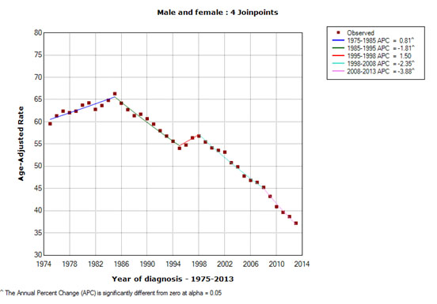

Joinpoint是用于使用连接点模型分析趋势的统计软件，也就是像下图所示的模型，其中几条不同的线在“连接点”连接在一起。NCI出版物中报告的癌症趋势是使用Joinpoint回归程序计算的，以分析由SEER*Stat软件计算的比率。

Joinpoint软件有两个版本：桌面和命令行。
1. 桌面版: 桌面版本存在图形交互界面，适合个人在PC上使用。
目前最新版本: Version 4.9.0.1 – February 7, 2022. 
1. 命令行版: 命令行版本适合通过其他软件如SAS或R调用来批量运行。目前最新版本: Version 4.9.0.0 – March 25, 2021.

该软件利用趋势数据(例如癌症发病率)，拟合数据允许的最简单的连接点模型。用户可以设置连接点的最小和最大数量。该程序从连接点的最小数开始(例如，0连接点，将拟合一条直线)，并检验更多连接点是否在统计上有意义并且必须添加到模型中(直到该最大数目)。这使我们能检验趋势的明显变化是否有统计学意义。显著性检验使用Monte Carlo Permutation方法。模型可以纳入每个点的估计变化(例如，当响应是年龄调整的比率时)，或者使用泊松变化模型。此外，模型还可以在响应变量的对数上是线性的(例如，用于计算年度百分比变化)。该软件还允许查看每个连接点模型的一个图表，从连接点数量最少的模型到连接点数量最大的模型。

关于软件的详细参数信息可以参考一下文献：

Kim HJ, Fay MP, Feuer EJ, Midthune DN. Permutation tests for joinpoint regression with applications to cancer rates. Stat Med 2000;19:335-51 (correction: 2001;20:655).

