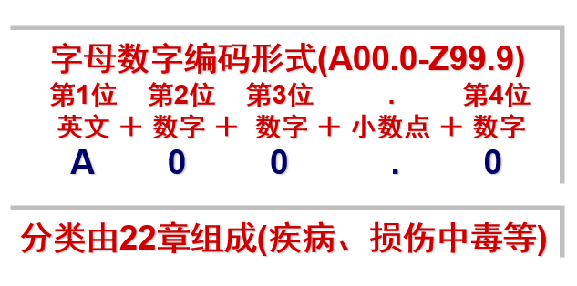

## ICD10是什么？

ICD10是疾病和有关健康问题的国际统计分类第十次修订本(The International Classification of Diseases ，ICD10)。国际疾病分类（ICD）是WHO制定的国际统一的疾病分类方法，它是一个根据疾病的特征，将疾病分门别类，成为一个有序的组合，并用编码的方法来表示的系统。。ICD分类体系使卫生从业人员能够通过一种通用语言来交换世界各地的卫生信息。

ICD已有110年的发展历史了，早在1891年为了对死亡进行统一登记，国家统计研究所组织了一个对死亡原因分类的委员会进行工作，1893年委员会主席Jacques Bertillon 提出了一个分类方法《国际死亡原因编目》，这就是第一版ICD。以后，基本上以每10年为一个周期修订一次。1989年在日内瓦 第10次修改版本在世界范围内得到广泛应用。一直沿用至今。


## ICD10编码的分类依据

任何一个分类体系都需要有分类的依据，ICD的分类原则是以病因为主、解剖部位、病理、临床表现为轴心的基本原则，分类体系的依据如下：

-   病因：造成疾病的原因
-   部位：疾病发生的部位
-   病理特征：肿瘤良性或恶性
-   临床表现：疾病的症状、体征、分期、分型、急慢性等

下图列出了ICD10编码不同章节编码的分类依据。

```{r,echo=FALSE,fig.alt="肿瘤登记ICD10分类依据"}
knitr::include_graphics("category.png")
knitr::include_graphics("category2.png")
```

## ICD10编码的基本结构及特点

WHO只提供了4位编码的ICD10，各国在引用的时候可以添加附加码来增加疾病数量。根据WHO规定，各国本地化版本都可以对照转化成标准的ICD-10编码，以便国际间交流。

```{r,echo=FALSE,fig.alt="ICD10编码的基本结构及特点"}

```

WHO提供的基础版本只有4位编码，比如*C16.0*，但是临床常见的编码多为6位，比如*K29.401*，而增加的两位是我们国家根据实际应用需要增加的**拓展码**。

## ICD10哪些编码是肿瘤？

-   C00-C97 恶性肿瘤
-   D00-D09 原位肿瘤
-   D10-D36 良性肿瘤
-   (D32-D33中枢神经系统的良性肿瘤)
-   D37-D48 动态未定肿瘤
-   （D42-D43中枢神经系统动态未定肿瘤）

目前我国肿瘤登记要求上报的范畴包括全部恶性肿瘤+中枢神经系统的肿瘤+原位肿瘤，也就是所有恶性肿瘤 + D32-33 和 D35.2-4 + D00-D09

## ICD10编码与ICDO3有何异同点？

前面的几篇文章介绍了[ICDO3编码的结构和特点](https://chenq.site/tech/2021-icdo3/)，我们知道ICDO3编码是在ICD的基础上发展成为一个既有解剖学部位、又有形态学编码系统的双重分类体系。

其实我们现在讨论的ICD10编码与ICDO3编码有何异同，也是指的ICD10和ICDO3的*解剖学部位编码*有何异同？

**ICD-10与ICD-O-3解剖部位编码不一致**

下表列出的疾病在ICD10编码和ICDO3编码存在一点差异，主要是对于亚部位未特指的编码在ICD10中直接省去小数点及后面的编码，也就是三位编码（C01），而ICDO3中则用.9来表示亚部位未特指，如（C01.9）。

| 疾病描述                   | ICD10 | ICDO3 |
|----------------------------|-------|-------|
| 舌根/舌底                  | C01   | C01.9 |
| 腮腺NOS                    | C07   | C07.9 |
| 梨状窦/梨状窝              | C12   | C12.9 |
| 直肠乙状结肠连接处         | C19   | C19.9 |
| 直肠壶腹/直肠NOS           | C20   | C20.9 |
| 胆囊                       | C23   | C23.9 |
| 气管                       | C33   | C33.9 |
| 胸腺                       | C37   | C37.9 |
| 阴道                       | C52   | C52.9 |
| 子宫NOS                    | C55   | C55.9 |
| 卵巢                       | C56   | C56.9 |
| 胎盘                       | C58   | C58.9 |
| 前列腺NOS                  | C61   | C61.9 |
| 肾（实质）                 | C64   | C64.9 |
| 肾盂/肾盏/肾盂输尿管连接处 | C65   | C65.9 |
| 输尿管                     | C66   | C66.9 |
| 甲状腺                     | C73   | C73.9 |
| NOS                        | C80   | C80.9 |

**ICDO3解剖学部位编码独有而ICD10中不存在的编码**

-   C42造血和网状内皮系统
-   C42.0 血液
-   C42.1 骨髓
-   C42.2 脾
-   C42.3 网状内皮系统NOS
-   C42.4 造血系统NOS

这部分编码一般对应ICD10的编码范围为C81.0\~C96.9

**ICD10独有的编码**

ICD10编码的C22.0至C22.9是包含解剖学部位和形态学信息的编码，比如C22.0为发生在肝脏的干细胞癌，C22.2是发生与肝脏的母细胞瘤；而这些编码与两个ICDO3的解剖学部位编码对应，一个是C22.0肝脏和一个是C22.1肝内胆管，而ICD编码中的形态学信息则放入ICDO3编码的形态学编码里。比如ICD10编码的C22.2转换为ICDO3则为C22.0 M8970/33。

| 疾病描述              | ICD10 | ICDO3解剖学   |
|-----------------------|-------|---------------|
| 肝细胞癌              | C22.0 | C22.0         |
| 肝内胆管癌/肝小胆管癌 | C22.1 | C22.1 M8180/3 |
| 肝母细胞瘤            | C22.2 | C22.0 M8970/3 |
| 肝血管肉瘤            | C22.3 | C22.0         |
| 肝的其它肉瘤          | C22.4 | C22.0         |
| 其它特指的肝癌        | C22.7 | C22.0         |
| 肝，NOS               | C22.9 | C22.0         |
| 皮肤恶性黑色素瘤      | C43   |               |
| 唇                    | C43.0 | C44.0         |
| 眼睑                  | C43.1 | C44.1         |
| 耳和外耳道            | C43.2 | C44.2         |
| 面部其它，NOS         | C43.3 | C44.3         |
| 头皮和颈              | C43.4 | C44.4         |
| 躯干                  | C43.5 | C44.5         |
| 上肢                  | C43.6 | C44.6         |
| 下肢                  | C43.7 | C44.7         |
| 皮肤交搭跨越          | C43.8 | C44.8         |
| 皮肤，NOS             | C43.9 | C44.9         |
| 脾                    | C26.1 | C42.2         |

ICD10编码里的良性肿瘤/原位癌/动态未定等信息转换为ICDO3的行为编码，也就是说ICDO3的解剖学编码都是以C开头，而不存在以D或其它字母开头的情况。

| 疾病诊断                 | ICD10范围 | ICDO3 行为编码 |
|--------------------------|-----------|----------------|
| 原位肿瘤                 | D00-D09   | 2              |
| 良性肿瘤                 | D18-D35   | 0              |
| 动态未定或动态未知的肿瘤 | D39-D48   | 1              |

其他ICD10独有的编码

| 疾病诊断               | ICD10   | ICDO3                 |
|------------------------|---------|-----------------------|
| 间皮瘤                 | C45     |                       |
| 胸膜瘤                 | C45.0   | C38.4                 |
| 腹膜间皮瘤             | C45.1   | C84.\_                |
| 心包间皮瘤             | C45.2   | C38.0                 |
| 其他部位的间皮瘤       | C45.7   |                       |
| 间皮瘤，未特指         | C45.9   |                       |
| 卡波西肉瘤             | C46     | M9140/3，可发生多部位 |
| 呼吸和消化器官的继发   | C78     | C80.9                 |
| 其他部位的继发         | C79     | C80.9                 |
| 淋巴、造血和有关组织   | C81-C96 | C42.\_                |
| 独立的多个部位的原发性 | C97     |                       |
