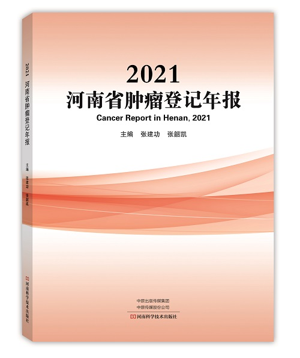
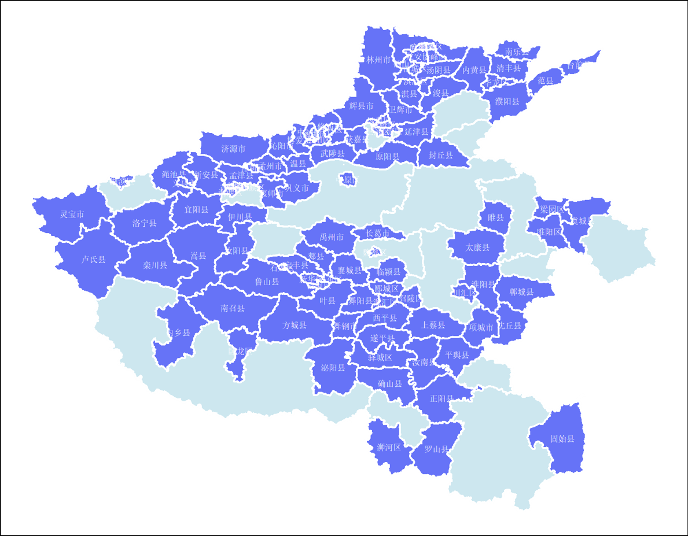

```{r include=FALSE}
knitr::opts_chunk$set(echo=FALSE,message=FALSE,warning=FALSE)
```



癌症是威胁河南省居民健康的一大类疾病，2022年4月，河南省癌症中心/河南省肿瘤医院重磅发布了《2021河南省肿瘤登记年报》（以下简称《年报》）。

《年报》利用2018年肿瘤登记数据描述了河南省登记地区恶性肿瘤发病死亡情况，它的发布可以为肿瘤病因学研究、制定卫生工作规划和肿瘤防治计划、评价和考核肿瘤防治效果等工作提供基础数据。

《年报》使用河南省39个合格肿瘤登记处的数据分析了2018年河南省登记地区的恶性肿瘤负担。数据显示，2018年，河南省肿瘤登记地区恶性肿瘤新发90609例，发病率为272.33/10万；恶性肿瘤死亡53592例，死亡率为162.16/10万。城乡分析结果显示，城市地区的恶性肿瘤发病率高于农村地区，而死亡率则为农村地区高于城市地区。

## 河南省恶性肿瘤发病死亡特征

肺癌是男性最常见的恶性肿瘤，占男性全部诊断恶性肿瘤病例的25.18%；乳腺癌则位居女性恶性肿瘤发病的第一位，占全部女性肿瘤病例的17.01%；不管是男性还是女性，肺癌均位居全部恶性肿瘤死亡的第一位。发病前10位的恶性肿瘤分别为肺癌、乳腺癌、胃癌、食管癌、肝癌、子宫颈癌、结直肠癌、甲状腺癌、子宫体癌和卵巢癌，占全部恶性肿瘤发病数的78.60%。

```{r,echo=FALSE,warning=FALSE,message=FALSE}
library(dplyr)
library(ggplot2)
library(cowplot)
data <- read.csv("t1.csv") %>%
  filter(areacode=="500000",!(sex=="合计")) %>%
  group_by(sex) %>%
  arrange(rate) %>%
  slice(13:22) %>%
  mutate(by=ifelse(code==110,"肺",ifelse(code==106,"肝",ifelse(code==105,"结直肠",ifelse(code==112,"乳腺",ifelse(code==119,"脑",by))))),
         cate=paste0(by,"癌",sep=""),
         rate=round(rate,1))
  data %>% 
    filter(sex=="男性") %>%
    arrange(rate)%>%
    mutate(cate=factor(cate,unique(cate)),
             rate=-rate)%>%
    ggplot(aes(y=cate))+
    geom_bar(aes(x=rate),fill="#1f78b4",stat = "identity")+
    geom_text(aes(x=rate,y=cate,label=abs(rate)),hjust=1)+
    theme_void()+
    scale_x_continuous(limits=c(-75,0),position = "top",labels=abs)+
    xlab(expression(paste("男性率（1/", 10^5,")")))+
    scale_y_discrete(position = "left")+
    theme(
      plot.background = element_blank(),
      axis.text.x = element_text(size=10),
      axis.text.y = element_text(size=10),
      axis.line.y=element_blank(),
      axis.title.y =element_blank(),
      axis.title.x =element_text(face="bold",size=12),
      axis.ticks.y = element_blank()
        )->p1
  
    data %>% 
    filter(sex=="女性") %>% 
      arrange(rate) %>%
      mutate(cate=factor(cate,unique(cate))) %>%
    ggplot(aes(y=cate))+
      geom_bar(aes(x=rate),fill="#8F3551",stat = "identity")+
      geom_text(aes(x=rate,y=cate,label=abs(rate)),hjust=-0.3)+
      theme_void()+
      scale_x_continuous(limits=c(0,70),position = "top")+
      xlab(expression(paste("女性率（1/", 10^5,")")))+
      scale_y_discrete(position = "right")+
      theme(
        plot.background = element_blank(),
        axis.text.x = element_text(size=10),
        axis.text.y = element_text(size=10),
        axis.line.y=element_blank(),
        axis.title.y =element_blank(),
        axis.title.x =element_text(face="bold",size=12),
        axis.ticks.y = element_blank()
        )->p2
    
    plot_grid(p1,p2,nrow=1)
    
```

癌症总体发病率和死亡率均随着年龄的增加而升高，均在85岁以上的年龄组中达到峰值。但是不同的癌种具有不同的年龄分布模式，比如肺癌在40岁之前发病率相对平稳而之后则快速上升；前列腺癌则从60岁开始快速上升；乳腺癌、宫颈癌、甲状腺癌的发病高峰则在50岁左右等。

```{r,echo=FALSE,message=FALSE,fig.width=10}
library(dplyr)
library(ggplot2)
library(ggsci)
data <- read.csv("age_specific_rate.csv") %>%
  filter(areacode=="500000",type=="incidence",code %in% c(62,110,112,113,116,120,121,122)) %>%
  mutate(code=factor(code,levels = c(62,110,112,113,116,120,121,122),labels=c("全部癌种","肺癌","乳腺癌","宫颈癌","前列腺癌","甲状腺癌","淋巴瘤","白血病")))
data %>%
  ggplot(aes(x=age,y=rate,group=sex))+
  geom_line(aes(colour=sex),size=1.2)+
  scale_x_continuous(breaks = c(0,10,20,30,40,50,60,70,80))+
  facet_wrap(~code,nrow=2,scales = "free")+
  theme_classic()+
  xlab("年龄(岁)")+
  ylab(expression(paste("年龄别发病率（1/", 10^5,")")))+
  scale_color_lancet()+
      theme(
        legend.position=c(0.05,0.9),
        legend.title=element_blank(),
        strip.background = element_blank(),
        strip.text= element_text(size = 15),
        axis.text = element_text(face="bold"),
        axis.title.y = element_text(face="bold"),
        axis.line=element_line(size=0.5,colour="black"),
        axis.ticks = element_line(size=0.5,colour="black"))

```

在前10位恶性肿瘤发病中，消化系统肿瘤仍然占据主要地位，胃癌、食管癌、肝癌和结直肠癌等消化系统肿瘤病例占全部恶性肿瘤病例的39.68%，是影响河南省居民健康的主要肿瘤类型。

## 提高《年报》覆盖人口比例，提升数据全省代表性



河南省于1959年在林州市（原林县）建立第一个肿瘤登记处，开始进行食管癌的单病种登记工作，拉开了河南省肿瘤登记工作的序幕。之后，一些县区陆陆续续在全死因登记的基础上建立肿瘤登记处。2008年以后，中央转移支付地方项目对肿瘤登记工作进行经费支持，河南省肿瘤登记工作进入迅速发展期，肿瘤登记登记处的数量和数据质量都得到较大的提高。截至2021年底，河南省肿瘤登记地区覆盖全省人口的比例达到70%，形成了反映河南省城乡居民恶性肿瘤发病与死亡基本信息的肿瘤随访登记系统。自2013年起，河南省癌症中心/河南省肿瘤医院每年以年报的形式及时发布河南省肿瘤登记监测数据，《河南省肿瘤登记年报》成为河南省癌症预防控制的重要资料，也是河南省肿瘤登记监测工作的标志性成果之一。

由于肿瘤登记工作存在3年的滞后性，2021年《年报》收录了39个肿瘤登记处的2018年肿瘤发病死亡数据，覆盖人口3300万人，约占河南省2018年人口总数的30.51%。

## 多渠道开展质控工作，稳步提升数据质量

河南省肿瘤医院作为省级肿瘤登记处，积极组织全省各县区肿瘤登记专业人员开展业务培训，开发质量控制工具，开展线上质控等多途径开展质控工作，河南省肿瘤医院作为省级肿瘤登记处荣获“省级单位杰出贡献奖”。在全省肿瘤登记专业人员的共同努力下，河南省各县区肿瘤登记处的数据质量得到不断的提升，也得到国家癌症中心的认可。2021年共有28个县区肿瘤登记处荣获国家癌症中心奖励，其中，1个登记处荣获“肿瘤登记工作杰出贡献奖”，16个肿瘤登记处荣获“肿瘤登记工作优秀奖”，11个登记处荣获“肿瘤登记工作进步奖”。

## 创新《年报》形式，促进数据共享利用

为了能让癌症防治专业人员和普通大众更方便、快捷的了解河南省癌症疾病负担情况，在出版纸质年报之外，我们也制作了线上《年报》，在内容展示方式以及获取途径上进行了创新，从而促进大家更方便的利用《年报》数据。大家可以通过手机扫描二维码在手机端查看年报，也可以通过电脑端输入网址：[https://chenq.site/report/2021/](https://chenq.site/report/2021/)进行查看。

```{r,out.width='25%'}
knitr::include_graphics(c("qrcode.png"))
```

## 积极建设全省癌症防治网络，降低癌症疾病负担

为了应对居高不下的癌症负担，河南省肿瘤医院/河南省癌症中心积极响应“健康中国行动-癌症防治行动”的要求，实施癌症信息化行动，健全肿瘤登记制度，提高肿瘤登记覆盖范围，提升肿瘤登记数据质量，促进信息资源共享利用；实施早诊早治推广行动，在城市和农村地区开展相应高发癌种的筛查早诊早治，提高癌症患者生存率；实施癌症诊疗规范化行动，提升管理服务水平；与此同时，也正积极推进全省的癌症防治网络建设工作，促进癌症防控工作系统化、标准化、信息化和常态化，以降低癌症疾病负担，提高癌症患者生存率。
